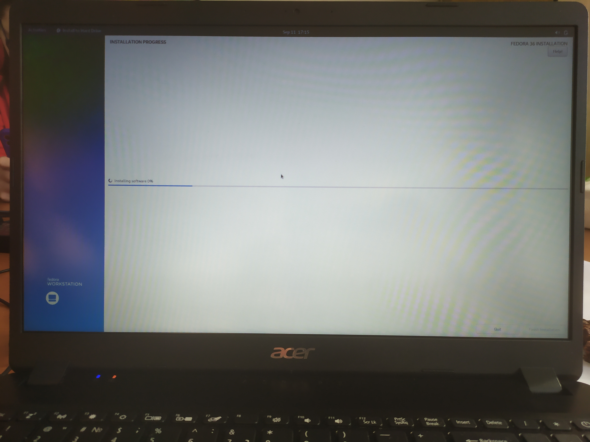
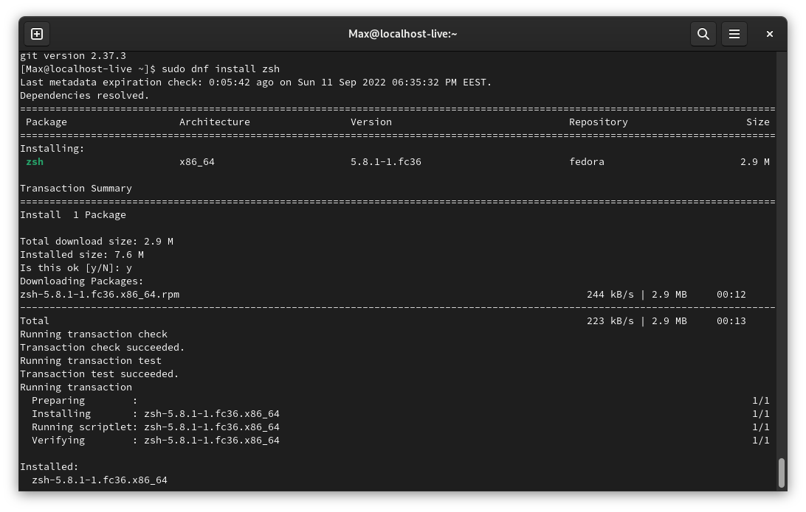
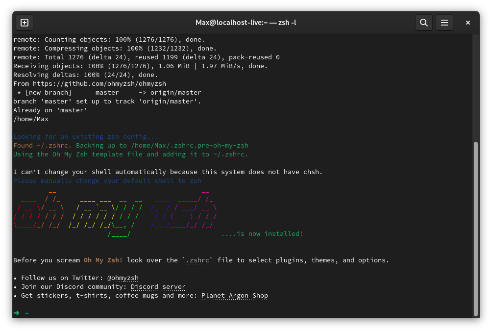
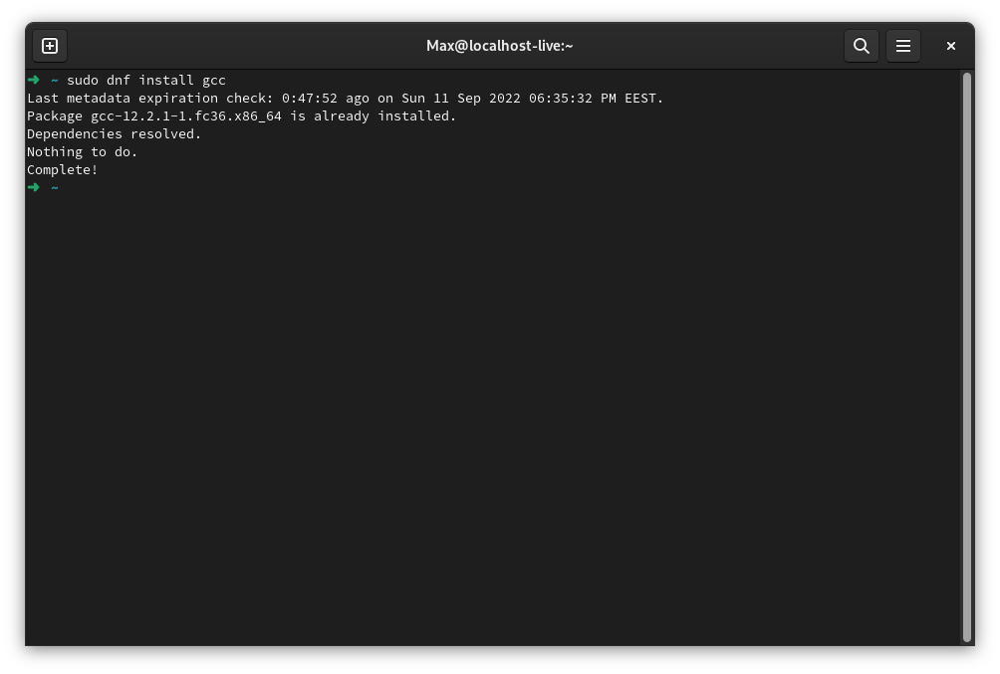
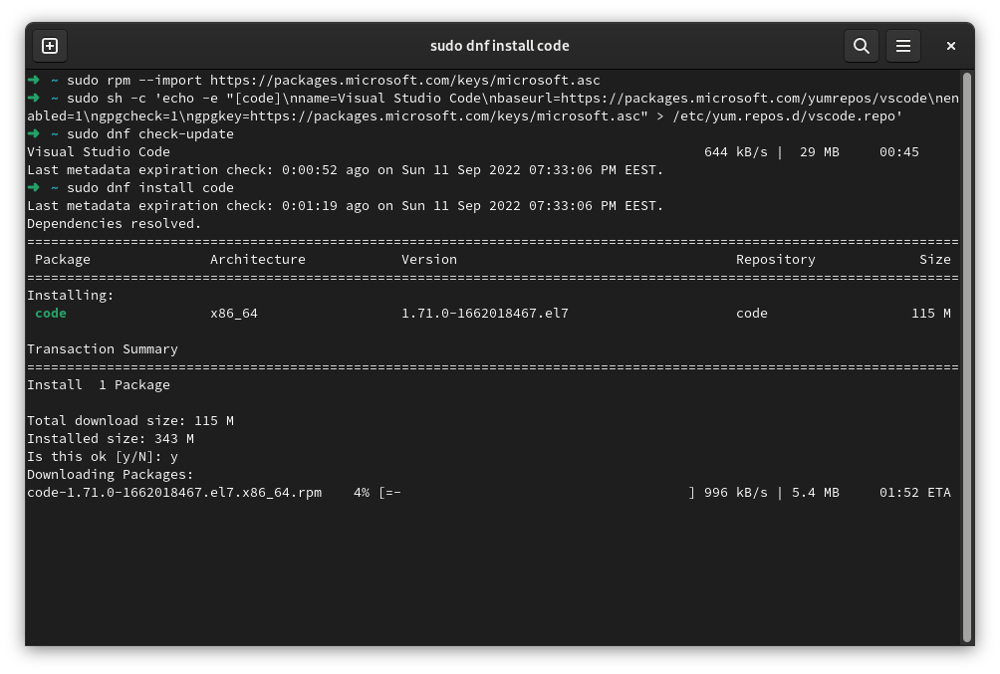
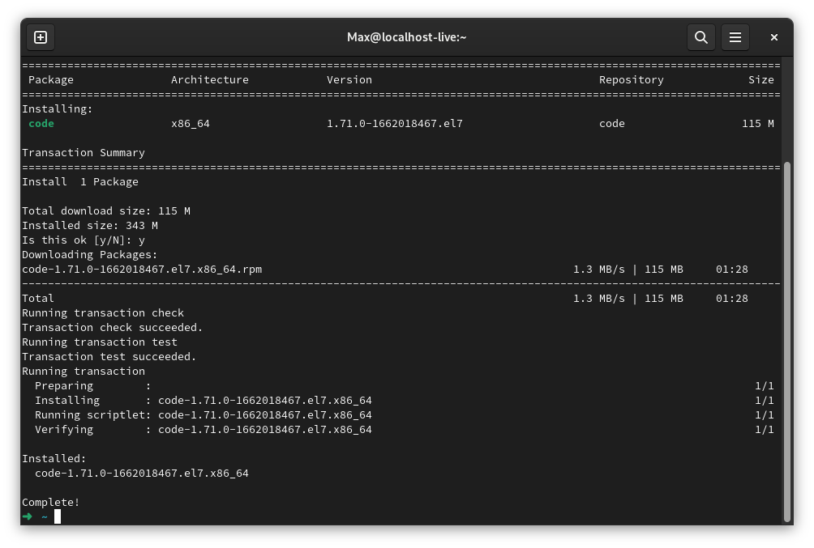

## STEP 1
### Fedora

Installing a UNIX-based operating system. I haven't worked with such an operating systems before and my choice fell on Fedora.

## STEP 2 
### Other tools

Installing ZSH.

Installong OH-MY-ZSH.

Installing GCC.

Installing VS Code.
